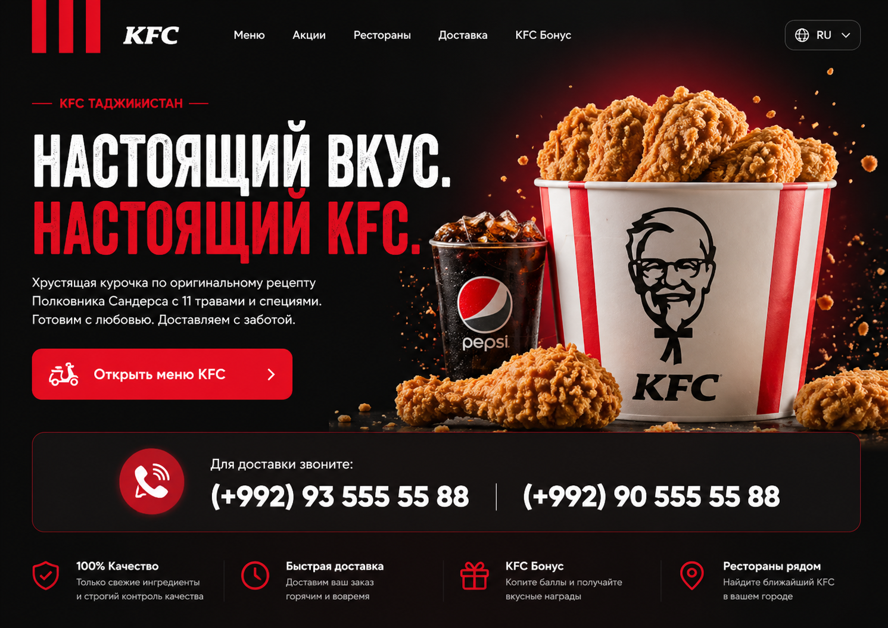

<!DOCTYPE html>
<html lang="ru">
<head>
  <meta charset="UTF-8">
  <meta name="viewport" content="width=device-width, initial-scale=1.0">
  <title>KFC Tajikistan — Demo Landing</title>
  <link rel="preconnect" href="https://fonts.googleapis.com">
  <link rel="preconnect" href="https://fonts.gstatic.com" crossorigin>
  <link href="https://fonts.googleapis.com/css2?family=Inter:wght@400;500;600;700;800;900&family=Oswald:wght@600;700&display=swap" rel="stylesheet">
  <link rel="stylesheet" href="style.css">
</head>
<body>

  

    
KFC

    
KFC Tajikistan

    <h1>Choose language</h1>
    

      Выберите язык сайта. После выбора откроется полный лендинг.
    

    

      <button onclick="setLanguage('ru')">Русский</button>
      <button onclick="setLanguage('en')">English</button>
    

  

<header class="header">
  <a href="#home" class="brand">
    

    <strong>KFC</strong>
  </a>

  <nav class="nav">
    <a href="https://www.kfc.tj/menu" target="_blank" data-ru="Меню" data-en="Menu">Меню</a>
    <a href="#delivery" data-ru="Доставка" data-en="Delivery">Доставка</a>
    <a href="https://www.kfc.tj/stores" target="_blank" data-ru="Рестораны" data-en="Restaurants">Рестораны</a>
    <a href="https://www.instagram.com/kfcintajikistan/" target="_blank">Instagram</a>
  </nav>

  <button class="language-btn" onclick="openLanguage()">🌐 RU</button>
</header>

<main>
  <section class="hero" id="home">
    

      

        
        
KFC ТАДЖИКИСТАН

        
      

      <h1 data-ru="НАСТОЯЩИЙ ВКУС. <em>НАСТОЯЩИЙ KFC.</em>" data-en="REAL TASTE. <em>REAL KFC.</em>">
        НАСТОЯЩИЙ ВКУС. <em>НАСТОЯЩИЙ KFC.</em>
      </h1>

      

        Хрустящая курочка по оригинальному рецепту Полковника Сандерса с 11 травами и специями. Готовим горячо. Доставляем быстро. Заказать можно прямо из официального меню KFC Tajikistan.
      

      <a href="https://www.kfc.tj/menu" target="_blank" class="order-main">
        🛵
        Открыть меню KFC
        <b>›</b>
      </a>
    

    

      
    

    

      <a class="phone-icon" href="tel:1400">☎</a>
      

        
Для доставки звоните:

        

          <a href="tel:1400">1400</a>
          
          <a href="tel:1212">1212</a>
        

      

    

    

      <a href="tel:1400" class="action-card">
        <i>☎</i>
        

          <h3 data-ru="Позвонить 1400" data-en="Call 1400">Позвонить 1400</h3>
          
Быстрый звонок для доставки

        

      </a>

      <a href="tel:1212" class="action-card">
        <i>📞</i>
        

          <h3 data-ru="Позвонить 1212" data-en="Call 1212">Позвонить 1212</h3>
          
Второй номер доставки KFC

        

      </a>

      <a href="https://www.kfc.tj/stores" target="_blank" class="action-card">
        <i>📍</i>
        

          <h3 data-ru="Рестораны рядом" data-en="Nearby restaurants">Рестораны рядом</h3>
          
Открыть официальную карту ресторанов

        

      </a>

      <a href="https://www.instagram.com/kfcintajikistan/" target="_blank" class="action-card">
        <i>◎</i>
        

          <h3>Instagram</h3>
          
Официальный аккаунт KFC Tajikistan

        

      </a>
    

  </section>

  <section class="section photo-section" id="menu">
    

      
KFC фото

      <h2 data-ru="Все изображения на сайте связаны с KFC." data-en="All images on the site are related to KFC.">Все изображения на сайте связаны с KFC.</h2>
      

        Вместо случайных фото используются изображения KFC-ресторанов и KFC-визуал в красно-чёрном стиле.
      

    

    

      <article class="photo-card reveal">
        
        

          <h3>KFC Оперка</h3>
          
Проспект Рудаки 33а, Душанбе

        

      </article>

      <article class="photo-card reveal">
        
        

          <h3>KFC Ашан</h3>
          
Официальное фото ресторана KFC Tajikistan

        

      </article>

      <article class="photo-card reveal">
        
        

          <h3>KFC 82</h3>
          
Официальное фото ресторана KFC Tajikistan

        

      </article>
    

  </section>

  <section class="split">
    

      
    

    

      
Заказ без лишних шагов

      <h2 data-ru="Точные ссылки вместо пустых кнопок." data-en="Exact links instead of empty buttons.">Точные ссылки вместо пустых кнопок.</h2>
      

        На сайте оставлены только полезные действия: открыть официальное меню, позвонить на доставку, найти ресторан и перейти в официальный Instagram. Всё остальное убрано, чтобы не путать пользователя.
      

      <a href="https://www.kfc.tj/menu" target="_blank" class="order-main small">
        Открыть официальное меню
        <b>›</b>
      </a>
    

  </section>

  <section class="contact" id="contact">
    

      
KFC Tajikistan

      <h2 data-ru="Закажите через официальное меню или позвоните на доставку." data-en="Order through the official menu or call delivery.">Закажите через официальное меню или позвоните на доставку.</h2>
      

        <a href="https://www.kfc.tj/menu" target="_blank">Menu</a>
        <a href="tel:1400">Call 1400</a>
        <a href="tel:1212">Call 1212</a>
        <a href="https://www.kfc.tj/stores" target="_blank">Stores</a>
      

    

  </section>
</main>

<footer>
  
KFC Tajikistan · Demo landing page

  

    <a href="https://www.instagram.com/kfcintajikistan/" target="_blank">Instagram KFC</a>
    <a href="https://www.kfc.tj/menu" target="_blank">Menu</a>
    <a href="https://www.kfc.tj/stores" target="_blank">Stores</a>
  

  

    Разработчик:
    <a href="https://www.instagram.com/idris.codes/" target="_blank">Sharipov Idris · @idris.codes</a>
  

</footer>

</body>
</html>
